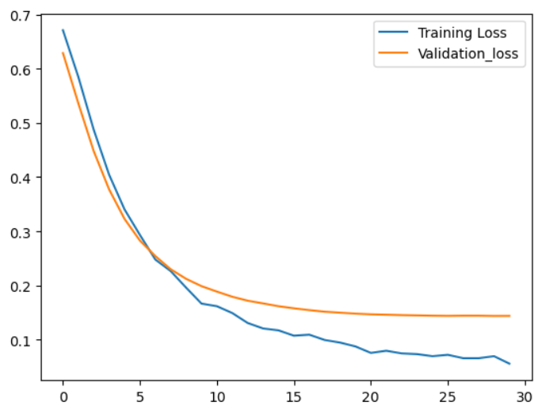
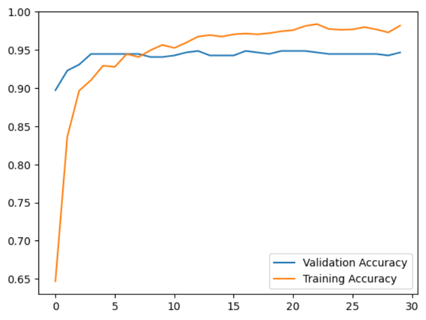
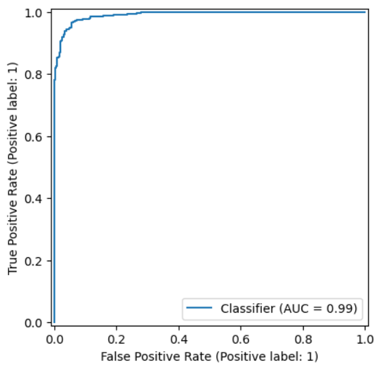
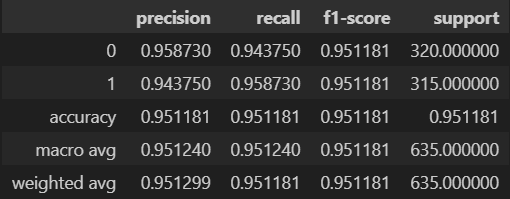

# Filipino Fake News Neural Network

## Description
Inspired by a research paper released last 2022 (see at the bottom), I decided to develop a fake news classifier model trained with the same dataset, but is constructed using Neural Networks.
For this use case, I used Tensorflow.

### Contents

### Quick Figures:

Train vs Validation Loss



Train vs Validation Accuracy




ROC_AUC Curve




Classification Report (generated through scikit-learn)



## Contents

The repository contains the following:
- **Data**:

  Contains the original .csv dataset (titled "full.csv") as well as its split versions, train and test, with train containing 80% of the data,
  while the test contains the remaining 20%.
  These Datasets are preprocessed by the Data_Preprocessing notebook located in the /Notebooks directory.
- **Models**:

  Contains the models saved through tensorflow's .keras extension; there's minimal difference between each model, but for the purposes of demonstration,
  the _v6 variant was selected.
- **Notebooks**

  Contains the notebooks used to preprocess the data, construct the neural network, and evaluation.
  - Data_Preprocessing contains the preprocessing procedure on the dataset
  - Model_Training contains the neural network construction and its training, as well as some visualization on the model's performance during training.
  - Model_Evaluation contains the neural network's performance on unseen data.
- **img**

  used for storing the images shown here.
- **tools**

  contains the dumped pkl file of the vectorizer used for data preprocessing. I used TfIdf Vectorizer for this case.
  
## Data Source
The dataset was originally sourced from Huggingface: 

https://huggingface.co/datasets/jcblaise/fake_news_filipino

With the authors:
```bibtex
@inproceedings{cruz2020localization,
  title={Localization of Fake News Detection via Multitask Transfer Learning},
  author={Cruz, Jan Christian Blaise and Tan, Julianne Agatha and Cheng, Charibeth},
  booktitle={Proceedings of The 12th Language Resources and Evaluation Conference},
  pages={2596--2604},
  year={2020}
}
```
The stemming portion of the code would not be possible without the help of this library:
```bibtex
https://github.com/andrianllmm/tagalog-stemmer.git
```

   
Original paper
---
This model was originally created using Naive Bayes classifier; you can learn more from here:

```bibtex
@INPROCEEDINGS{9971596,
  author={Billones, Paolo Joshua R. and Macasaet, Dailyne D. and Arenas, Shearyl U.},
  booktitle={2022 IET International Conference on Engineering Technologies and Applications (IET-ICETA)}, 
  title={Bilingual Fake News Detection Algorithm Using Naïve Bayes and Support Vector Machine Models}, 
  year={2022},
  volume={},
  number={},
  pages={1-2},
  keywords={Training;Support vector machines;Deep learning;Adaptation models;Machine learning algorithms;Neural networks;Predictive models;machine learning;fake news detection;classifier models;bilingual algorithm},
  doi={10.1109/IET-ICETA56553.2022.9971596}}
```


